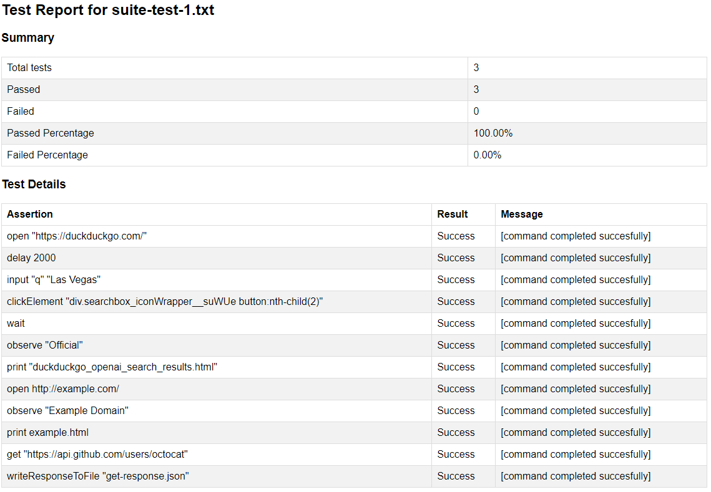

# Simple Regression Automation Framework (SRAF)

## **Installation and Setup**

Follow these steps to get started with the Simple Regression Automation Framework:

### **1. Prerequisites**
- Ensure you have [Node.js](https://nodejs.org/) installed on your system. If not, you can download and install it from [here](https://nodejs.org/en/download/).

### **2. Download the Framework**
- Navigate to the https://github.com/jjsarf/Simple-Regression-Automation-Framework/ .
- Click on `Simple-Regression-Automation-Framework.zip`.
- Click the `Download` button to download the zip file to your system.

### **3. Extract the Framework**
- Once downloaded, locate the `Simple-Regression-Automation-Framework.zip` file on your system.
- Right-click (or Ctrl-click on macOS) on the zip file and select `Extract All` (the exact option might vary based on your operating system).
- Choose a suitable location and extract the contents.

### **4. Install Dependencies**
- Navigate to the directory where you extracted the framework using your terminal or command prompt.
- Run the following command to install necessary dependencies:
  ```
  npm install
  ```

### **5. Ready to Use**
- At this point, the framework is set up and ready to use. Refer to the documentation below for further instructions.

## Motivation
The Regression Automation Framework (SRAF) emerges from the need to address the drawbacks of manual testing. Manual regression testing can be repetitive, time-consuming, error-prone, and lacks scalability. SRAF aims to make website regression testing easy by abstracting coding from testing and employing a simple English vocabulary to devise test scenarios. Hence, you don't need to learn Java, Python or any other language to create regression automation scripts.

## Why Automate with SRAF?
- **Consistency and Repeatability**: With SRAF, tests can be executed repeatedly across different environments, ensuring that the test scenarios remain consistent.
- **Speed**: Automated tests significantly decrease the time to run repetitive tasks compared to manual testing.
- **Accuracy**: Automation eliminates the risk of human error, which is common in repetitive and mundane tasks.
- **Cost-Effective in the Long Run**: While setting up automation might need an initial investment, the return is substantial in terms of time saved in the long run.
- **Immediate Feedback**: Developers receive instant feedback, allowing quick rectifications and validating that the changes function as expected.

## Vocabulary
SRAF provides a set of easy-to-understand commands:

- **open**: Opens a specified URL.
- **observe**: Waits until a specified text appears on the page.
- **click**: Clicks an element with a specified CSS selector or link with specified text.
- **wait**: Waits for the next page to load.
- **delay**: Waits for a specified duration.
- **print**: Saves the HTML content of the current page to a specified file.
- **input**: Enters a specified text into an element with a specified CSS selector.
- **submit**: Submits a form with a specified CSS selector.
- **login**: Logs into a page by entering username and password into specified elements.
- **clickInputButton**: Clicks an input button with a specified value.
- **post**: Sends a POST request to a specified URL with the specified body and saves the response. This capability is similar to postman utility.
- **get**: Sends a GET request to a specified URL and saves the response. This capability is similar to postman utility.
- **observeResponse**: Checks if the last response contains a specified text.
- **writeResponseToFile**: Writes the last response to a specified file.

## How SRAF Works
SRAF is a straightforward regression automation tool rooted in Node.js and the Puppeteer module. It interprets commands from a file specified as a command-line argument and can employ a proxy server as detailed in the config.json file.

SRAF operates in a non-headless browser by default, making its actions visible. However, transitioning to headless mode is as simple as toggling the headless option in config.json file by changing the headless property.

Every action is meticulously logged, stating its success or failure. In the occurrence of a failed step, SRAF progresses to the subsequent step but labels the entire test as unsuccessful.

## Benefits of SRAF
- **Ease of Use**: Simple English vocabulary for cSRAFting regression tests and suites.
- **Clarity**: Test scenarios in comprehensible plain text files.
- **Tech-savvy**: Utilizes Puppeteer for precise browser automation and reliable testing outcomes.
- **Versatility**: Automates a wide range of actions including form submissions and page navigations.
- **Efficiency**: Ensures that issues brought about by updates or alterations are promptly detected.
- **Stability**: Regular and repeatable regression testing enhances application stability.

## Simplicity
SRAF champions simplicity, catering to users of diverse expertise. Unlike intricate tools like Cucumber demanding a grasp on Behavior-Driven Development (BDD), SRAF simplifies the procedure by letting tests be scripted in plain text files using a lucid English language vocabulary. This inclusivity encourages developers and testers, irrespective of their familiarity, to employ and gain from automated testing efficiently. The essence of SRAF is to let you zero in on fortifying the dependability and caliber of your web application.

## Supported Browsers
### Chromium (Default)
Puppeteer ships with a bundled version of Chromium, which is the open-source version of Chrome. The majority of Puppeteer scripts and tools are expected to run with this version since it ensures consistency.

### Chrome
Puppeteer can also control full Chrome versions. This means you can use Puppeteer with the regular Chrome browser you might already have installed on your machine. However, there might be slight differences in behavior between Chrome and the bundled Chromium.

### Microsoft Edge
Starting with Microsoft Edge version 79, Edge switched its base to Chromium. This change means that Puppeteer can also control newer versions of Microsoft Edge.

### Firefox (Experimental)
There's an experimental version of Puppeteer for Firefox. This was in an experimental phase for quite some time and may not support all Puppeteer features, but it's an indication that the team is looking to broaden Puppeteer's browser support.

## Command Files
The SRAF nodejs scripts operate based on instructions specified in "command files". These are simple text files that enumerate a series of actions for the script to undertake. Each action or command is presented on a new line, and the script follows through in sequence. Each line represents a single assertion for the overal test found in a particular command file.

## **Command File Structure**

Each line within the command file represents a distinct action. The initial word of each line characterizes the type of the command (like `open`, `click`, `observe`, etc.), and the words or parameters that follow provide specifics for that command.

## **Sample Single Test Command File**:

```plaintext
open https://www.duckduckgo.com
input #search_form_input_homepage DuckDuckGo Features
click #search_button_homepage
observe Private search engine
```

In this example:

1. The browser is directed to the DuckDuckGo homepage.
2. "DuckDuckGo Features" is entered into the search input box identified by `#search_form_input_homepage`.
3. A click event is executed on the search button identified by `#search_button_homepage`.
4. The resulting page is scrutinized to ensure it contains the text "Private search engine".


## **Sample Test Suite File**:
```plaintext
test-sample-duckduckgo-search.txt
test-print-page-html.txt
test-sample-get-request.txt
```

### Explanation:
In this example test suite:

1. The test runner is directed to execute the test command script named `test-sample-duckduckgo-search.txt`, which could perform actions related to searching on DuckDuckGo.
2. Next, the test runner will execute the test command script `test-print-page-html.txt` that might be designed to print or capture the HTML of a specific webpage.
3. Lastly, the suite will run the test command script `test-sample-get-request.txt`, which might be structured to perform a sample GET request to a specific URL and verify the response.

The test suite file essentially serves as a list of individual test command scripts that the runner will execute in sequence. Each line of the file represents a different test command script to be executed.


## Running a Single Automation Command Script

### Prerequisites
- Ensure you have Node.js installed.
- Navigate to the directory containing your command files (e.g., [some-path]/SRAF/tests/).
- Make sure to install the necessary dependencies (`puppeteer`, `fs`, and `path`).
- Ensure that a valid `config.json` file exists in the specified directory.

### Execution

Run the script using the following command:

```bash
node ..\run\singletest.js <FILENAME> [--useProxy]
```

Replace `<FILENAME>` with the path to your command file, such as `test-sample-duckduckgo-search.txt`. If you want to use a proxy, add the `--useProxy` argument at the end.

**Example:**

```bash
node ..\run\singletest.js test-sample-duckduckgo-search.txt --useProxy
```
<hr>

## Running a Full Automation Test Suite

### Prerequisites

- **Node.js**: Ensure you have Node.js installed.
- **Script Directory**: Navigate to the directory containing your test suite file (e.g., `[some-path]/SRAF/tests/`).
- **Dependencies**: Make sure to install the necessary dependencies (`puppeteer`, `fs`, and `path`).
  
  ```bash
  npm install puppeteer fs path
  ```
  
- **Configuration**: Ensure that a valid `config.json` file exists in the specified directory.

### Execution

To run the entire test suite, use the following command:

```bash
node ..\run\testsuite.js <INPUT_FILENAME> [--useProxy]
```

Replace `<INPUT_FILENAME>` with the path to your file containing a list of command script paths (e.g., `command-list.txt`). If you want the test suite to use a proxy during execution, append the `--useProxy` argument at the end.

### Example:

```bash
node ..\run\testsuite.js command-list.txt --useProxy
```

This will process each command file script listed in `command-list.txt`, execute them sequentially, and then generate a consolidated test report detailing the results of each script in the test suite.

--- 

Remember to adapt the paths and filenames to your actual project structure, if they differ from the provided examples.

<hr>

## `open` Command

### Description:
The `open` command is designed to navigate the browser to a specified URL.

### Syntax:
```
open [URL]
```

### Example:
To open Google's homepage:
```
open https://www.google.com
```

### How it Works:
1. SRAF initializes the browser instance using Puppeteer.
2. The `open` command instructs the browser to navigate to the specified URL.
3. The website is loaded in the browser, and SRAF waits for the "DOMContentLoaded" event, ensuring the page's main resources have been loaded.
4. SRAF logs the action and continues with the next command in the test scenario.

### Tips:
- Always use the full URL, including the protocol (`http://` or `https://`).
- Ensure there are no spaces in the URL. If necessary, encode special characters.
- It's a good practice to start your test scenario with the `open` command to set the initial state.
Would you like to proceed with the next command, observe?

<hr>

## `observe` Command

### Description:
The `observe` command waits until a specific text appears on the page, ensuring that the required content is visible and loaded.

### Syntax:
```
observe [TEXT_TO_LOOK_FOR]
```

### Example:
To wait until the text "Welcome to Google!" appears on the page:
```
observe Welcome to Google!
```

### How it Works:
1. Once the `observe` command is triggered, SRAF starts polling the page at regular intervals.
2. It searches for the specified text in the visible content of the web page.
3. If the text is found within a specified timeout (e.g., 30 seconds), SRAF logs the successful observation and proceeds to the next command.
4. If the text isn't found within the timeout, SRAF logs an error and marks this step as failed but continues with the subsequent steps.

### Tips:
- Use the `observe` command after actions that may lead to page changes, such as after a `click` command or page navigation.
- Ensure the text you're observing is unique and not likely to change frequently to avoid false negatives.
- Consider using this command sparingly to improve the speed of your tests. Instead, rely on more deterministic indicators like specific element attributes or statuses.

<hr>

## `click` Command 

### Description:
The `click` command simulates a mouse click on a specified element based on a CSS selector or on a link with the specified text.

### Syntax:
- For CSS Selector:
```
click [CSS_SELECTOR]
```
- For Link Text:
```
click link=[LINK_TEXT]
```

### Example:
1. To click on an element with the ID "submit-button":
```
click #submit-button
```
2. To click on a link with the text "Contact Us":
```
click link=Contact Us
```

### How it Works:
1. SRAF searches for the specified element or link on the web page.
2. If found, it triggers a mouse click event on that element.
3. If the element isn't found within a specified timeout (e.g., 30 seconds), SRAF logs an error and marks this step as failed but continues with the next commands.

### Tips:
- Ensure your CSS selector or link text is specific enough to avoid clicking on unintended elements.
- For dynamic elements or elements loaded with AJAX, consider using the `observe` command before the `click` command to ensure the element is loaded and visible.
- If a click leads to a new page load, consider using the `wait` command after `click` to ensure SRAF waits for the page to load before continuing.

<hr>

## `wait` Command 

### Description:
The `wait` command tells SRAF to pause its operations until the next webpage finishes loading, especially useful after performing actions that trigger a new page load or a refresh.

### Syntax:
```
wait
```

### Example:
1. After clicking on a link or a button that loads a new page:
```
click #next-page-button
wait
```

### How it Works:
1. Once the `wait` command is encountered, SRAF will halt its actions.
2. It then observes the browser's network activity to detect when the new page load is completed.
3. Upon successful page load, SRAF resumes its operation with the next command in sequence.
4. If the new page doesn't finish loading within a default timeout (e.g., 60 seconds), SRAF logs an error and marks this step as failed but moves on with subsequent commands.

### Tips:
- Always use the `wait` command after actions like `click` that are known to lead to page transitions.
- If you're dealing with AJAX-loaded content, consider using `observe` or `delay` instead, as they might be more suitable to ensure the content is loaded and visible before proceeding.

<hr>


## `delay` Command 

### Description:
The `delay` command instructs SRAF to pause its actions for a specified duration. This is particularly helpful when interacting with pages that have dynamic content that takes some time to appear but doesn't necessarily trigger a complete page load.

### Syntax:
```
delay <DURATION_IN_SECONDS>
```

### Example:
1. Waiting for 5 seconds after triggering a dropdown menu to allow its items to fully render:
```
click #dropdown-trigger
delay 5
```

### How it Works:
1. Once SRAF encounters the `delay` command, it will pause for the number of seconds specified.
2. After the delay duration is up, SRAF will resume with the next command in sequence.

### Tips:
- Use the `delay` command judiciously. While it's a powerful tool, relying on it too much can make your test suite run longer than necessary.
- It's often better to use the `observe` command to wait for a specific element or text to appear, as this can lead to more reliable and faster test execution.
- However, in scenarios where the exact time of appearance isn't predictable, `delay` becomes invaluable.

<hr>

## `print` Command 

### Description:
The `print` command enables SRAF to capture and save the HTML content of the currently viewed webpage to a specified file. This is especially useful when you want to inspect the state of a webpage at a particular point in your test scenario or for debugging purposes.

### Syntax:
```
print <FILENAME_WITH_PATH>
```

### Example:
1. Saving the HTML content of a page after submitting a form:
```
submit #contact-form
print ./logs/submitted-form.html
```

### How it Works:
1. Upon encountering the `print` command, SRAF retrieves the entire HTML content of the current page.
2. SRAF then writes this content to the file path specified in the command. If the file already exists, it will be overwritten; if not, a new file will be created.

### Tips:
- It's a good practice to organize saved HTML files into a dedicated directory (e.g., `./logs/`) to keep your project structure clean.
- Using meaningful filenames can help you quickly identify the state or scenario associated with the saved content.
- You can combine `print` with `observe` or other commands to ensure that you're capturing the page state at the right moment.

<hr>

## `input` Command 

### Description:
The `input` command is used in SRAF to simulate the action of entering specified text into a webpage element, typically a form input field. This can be helpful for actions like populating text boxes, textarea, password fields, and more.

### Syntax:
```
input <CSS_SELECTOR> <TEXT_TO_INPUT>
```

### Example:
1. Entering text into a search box:
```
input #search-input "Regression Automation Framework"
```

### How it Works:
1. SRAF looks for the element on the webpage using the provided CSS selector.
2. Once found, it simulates keypress events to input the specified text into that element.
3. If the element isn't found or isn't input-capable, the step will fail, and SRAF will log the failure.

### Tips:
- Ensure that the CSS selector you provide is unique and accurately identifies the target input element.
- If you're inputting sensitive data like passwords, be careful about where and how you store your SRAF command files to avoid potential security risks.
- Using the `input` command followed by `observe` can help verify that the input was correctly received by the webpage.
<hr>

## `submit` Command 

### Description:
The `submit` command in SRAF is designed to simulate the action of submitting a form on a webpage. This is extremely useful for testing actions such as logging in, submitting data, or any other form-based operations on your website.

### Syntax:
```
submit <CSS_SELECTOR_OF_FORM>
```

### Example:
1. Submitting a login form:
```
submit #login-form
```

### How it Works:
1. SRAF identifies the form element on the webpage using the provided CSS selector.
2. Once the form is located, SRAF triggers the submit action for that form.
3. If the form isn't found or isn't of the correct type, the step will fail, and SRAF will log the failure.

### Tips:
- Ensure the CSS selector you provide targets the form element accurately.
- Using the `submit` command after populating form fields using the `input` command is a common sequence in SRAF scripts.
- To verify the results of the form submission, you might follow up with the `observe` or `observeResponse` commands to check for expected outcomes.

<hr>

## `login` Command 

### Description:
The `login` command simplifies the process of logging into a webpage. Instead of using multiple commands to input a username, password, and then submit a form, the `login` command allows you to achieve all these steps with one concise command.

### Syntax:
```
login <CSS_SELECTOR_OF_USERNAME_INPUT> <USERNAME> <CSS_SELECTOR_OF_PASSWORD_INPUT> <PASSWORD> [<CSS_SELECTOR_OF_SUBMIT_BUTTON>]
```

*Note*: The submit button selector is optional. If not provided, SRAF will automatically trigger the form's submit action.

### Example:
1. Logging into a webpage:
```
login #username-input JohnDoe #password-input MySecretPassword123 #login-button
```

### How it Works:
1. SRAF locates the username input field using the provided CSS selector and enters the specified username.
2. Similarly, it finds the password input field and enters the specified password.
3. If a submit button selector is provided, SRAF will then click on the button. If not, it will automatically trigger the form's submit action.

### Tips:
- Ensure that the CSS selectors you provide are accurate and specific to avoid interactions with unrelated elements.
- After logging in, you might want to use the `observe` command to verify that the login was successful by checking for a specific piece of text or element on the page, like a user dashboard or a welcome message.

<hr>

## `clickInputButton` Command 

### Description:
The `clickInputButton` command allows SRAF to identify and click an input button based on its value. This is especially useful when multiple buttons might exist on a page, and you want to target one specifically by its displayed text.

### Syntax:
```
clickInputButton <BUTTON_VALUE>
```

### Example:
Suppose you have a webpage with multiple buttons, but you only want to click the button that says "Submit Feedback". Your command would look like:
```
clickInputButton "Submit Feedback"
```

### How it Works:
1. SRAF searches the webpage for an input button with a `value` attribute that matches the specified text.
2. Once found, SRAF clicks the button to trigger its associated action.

### Tips:
- Make sure the value you provide is unique to the button you want to click. If multiple buttons share the same value, SRAF might click an unintended one.
- If a button doesn't use the `value` attribute for its display text (e.g., it's a `<button>` element with inner text), consider using the `click` command with a CSS selector instead.

<hr>

## `post` Command 

### Description:
The `post` command is utilized to send a POST request to a specified URL. This can be handy for simulating form submissions, testing API endpoints, or any other scenario where a POST request is required. Additionally, the command allows you to send a specified request body and then save the response for verification.

### Syntax:
```
post <URL> <REQUEST_BODY> [responseVariableName]
```

### Example:
To send a POST request with a JSON payload to an API endpoint `https://api.example.com/user`, you would use:
```
post "https://api.example.com/user" '{"name": "John", "age": 30}'
```
To capture the response in a variable named `userCreationResponse`:
```
post "https://api.example.com/user" '{"name": "John", "age": 30}' userCreationResponse
```

### How it Works:
1. SRAF sends a POST request to the provided URL with the specified request body.
2. Any response received from the server will be logged by SRAF.
3. Optionally, if a responseVariableName is provided, SRAF will store the response in that variable for subsequent use or verification.

### Tips:
- Ensure that your request body is correctly formatted. For JSON payloads, it's crucial to use double quotes for both property names and string values.
- If testing API endpoints that require authentication, make sure to include any necessary headers or authentication tokens. This might involve prior steps using SRAF commands to retrieve authentication details.
- Use the subsequent `observeResponse` command to validate that the response contains specific expected values or texts.

<hr>

## `get` Command 

### Description:
The `get` command facilitates sending a GET request to a specified URL. This is particularly beneficial for fetching data from web services, testing API endpoints, or simply visiting web pages without initiating an action like clicking or form submissions.

### Syntax:
```
get <URL> [responseVariableName]
```

### Example:
To send a GET request to an API endpoint `https://api.example.com/user/123` and fetch a user's details:
```
get "https://api.example.com/user/123"
```
To capture the response in a variable named `userDetails`:
```
get "https://api.example.com/user/123" userDetails
```

### How it Works:
1. SRAF dispatches a GET request to the indicated URL.
2. SRAF logs any response received from the server.
3. Optionally, if a `responseVariableName` is furnished, SRAF will archive the response in that variable for future use or validation.

### Tips:
- For API endpoints demanding authentication, ensure to append any required headers or authentication tokens. This might necessitate preliminary steps using other SRAF commands to secure authentication specifics.
- Employ the subsequent `observeResponse` command to ascertain that the response embodies specific expected values or textual content.
- The `get` command is paramount for endpoints that only need data retrieval without causing side effects. It aligns with the HTTP standard wherein GET requests should only fetch data and not modify it.

<hr>

## `observeResponse` Command 

### Description:
The `observeResponse` command is designed to verify if the most recent HTTP response (usually from a `post` or `get` command) contains a particular text or string. It's especially crucial in regression testing to confirm that API endpoints return expected values.

### Syntax:
```
observeResponse <expectedText>
```

### Example:
After performing a `get` command to fetch user details:
```
get "https://api.example.com/user/123"
observeResponse "username: johnDoe"
```
This checks if the response contains the string `"username: johnDoe"`.

### How it Works:
1. SRAF checks the recent HTTP response for the existence of the specified `<expectedText>`.
2. If the `<expectedText>` is found in the response, the step is marked successful.
3. If not, the step fails, and SRAF logs the discrepancy.

### Tips:
- The `observeResponse` command is case-sensitive. Ensure that the `<expectedText>` exactly matches the expected response.
- This command is highly useful to ensure that data from APIs is consistent and that no regressions have been introduced in the returned values.
- Pairing the `observeResponse` with the `writeResponseToFile` command can be beneficial for preserving the actual response, which can then be compared with expected outcomes.

<hr>

## `writeResponseToFile` Command 

### Description:
The `writeResponseToFile` command allows you to save the last received HTTP response (typically from a `post` or `get` command) to a specified file. This is immensely beneficial for logging, debugging, and verifying the content of the responses over time.

### Syntax:
```
writeResponseToFile <filePath>
```

### Example:
After executing a `get` command to retrieve user details:
```
get "https://api.example.com/user/123"
writeResponseToFile "responses/user123.txt"
```
This will write the response to a file named "user123.txt" inside a "responses" directory.

### How it Works:
1. SRAF takes the latest HTTP response and writes its content to the specified `<filePath>`.
2. If the operation is successful, the step is marked as such.
3. If there are any errors (e.g., incorrect file path, permission issues, etc.), the step will fail, and SRAF will log the error.

### Tips:
- Ensure that the directory where you wish to save the file already exists. SRAF might not automatically create directories.
- Utilize this command in tandem with the `observeResponse` command. Saving responses will help you keep track of data and ensure consistency across regression tests.
- This is also an invaluable tool for debugging. If an API response changes unexpectedly, having a record of the previous response can help trace the cause of the discrepancy.

<hr>
 
## `Combining Commands for a Login Flow` 

### Description:
In real-world scenarios, a single command might not be enough. Regression testing often involves a sequence of actions that replicate user behaviors. One of the most common sequences is the login flow. Here's a step-by-step tutorial on how to combine SRAF commands for this purpose.

### Steps:

1. **Open the Login Page**:
To initiate the login process, first open the desired URL.
``` 
open "https://example.com/login"
```

2. **Enter Username**:
Assuming the username input field has a CSS selector of `.username-input`, you can input a username like so:
```
input ".username-input" "sampleUser"
```

3. **Enter Password**:
Similarly, for the password field with a CSS selector of `.password-input`:
```
input ".password-input" "securePassword123"
```

4. **Submit the Form**:
If the form has a CSS selector of `.login-form`, you can submit it with:
```
submit ".login-form"
```

5. **Wait for Successful Login**:
After submission, you'd typically be redirected to a dashboard or welcome page. Ensure the process is successful by observing a unique text, say "Welcome, sampleUser":
```
observe "Welcome, sampleUser"
```

6. **Perform Further Actions or Validate Features**:
Depending on your regression test requirements, you might want to click on specific links, check other pages, etc. Use the SRAF commands as necessary to accomplish this.

### Tips:
- Always ensure to observe specific texts or elements after each major action to confirm the expected behavior.
- For enhanced security, consider integrating environment variables or secure vaults to store and retrieve sensitive data like usernames and passwords.

### Potential Challenges:
- Dynamic content: If the website uses dynamic data, the exact text or elements might change. Consider observing more generic yet unique content.
- CAPTCHA: If the website has CAPTCHA challenges during login, manual intervention might be required. Consider discussing with the development team for a CAPTCHA-free environment for regression testing.

<hr>

## `Shopping Cart` 

### Description:
Online shopping carts are fundamental to e-commerce platforms. Testing their functionality is paramount to ensure customers can successfully select items, review their cart, and complete purchases. Let's learn how to utilize SRAF commands for a typical shopping cart checkout scenario.

### Steps:

1. **Open the Online Store's Homepage**:
Initiate by navigating to the main store page.
```
open "https://onlinestore.com"
```

2. **Select an Item**:
Click on an item's link or image to view its details. Suppose it has a CSS selector `.item1-link`.
```
click ".item1-link"
```

3. **Add Item to Cart**:
Once on the item's detail page, click the "Add to Cart" button. If the button has a CSS selector of `.add-to-cart-btn`:
```
click ".add-to-cart-btn"
```

4. **Proceed to Checkout**:
Navigate to the shopping cart to review the selected items and proceed to checkout. If the cart link has a CSS selector of `.checkout-link`:
```
click ".checkout-link"
```

5. **Review Cart and Checkout**:
Ensure the right items are in the cart. For instance, you can observe a unique product name or description:
```
observe "Awesome Product Name"
```
Then, click on the "Proceed to Checkout" button. If the button has a CSS selector of `.proceed-checkout-btn`:
```
click ".proceed-checkout-btn"
```

6. **Complete Purchase**:
Enter shipping and payment details as required (using the `input` command for each field), and finally, click on the "Complete Purchase" button, say with a CSS selector of `.complete-purchase-btn`.
```
click ".complete-purchase-btn"
```

### Tips:
- Due to dynamic cart values, prices, and possible discounts, always use unique but generic identifiers when observing items or totals.
- In test environments, try using dummy payment methods or sandbox modes to avoid actual transactions.

### Potential Challenges:
- Stock availability: Items might go out of stock, affecting the flow. Consider using sample items that are always available in test environments.
- Promo codes and offers: Dynamic promotions can alter cart values. Coordinate with the development team to ensure a consistent test environment.

<hr>

## `User Registration Flow` 

### Description:
User registration is a standard feature on most websites. It enables users to get personalized experiences, save preferences, and sometimes access restricted content. Ensuring a hassle-free registration process is vital for enhancing user experience and increasing user base. Let's see how SRAF commands can be used for a user registration test scenario.

### Steps:

1. **Navigate to the Registration Page**:
Start by accessing the main registration page.
```
open "https://samplewebsite.com/register"
```

2. **Enter User Details**:
Input various user details like name, email, password, etc. Suppose the name field has a CSS selector `.name-input`, the email field has `.email-input`, and the password field has `.password-input`.
```
input ".name-input" "John Doe"
input ".email-input" "johndoe@email.com"
input ".password-input" "P@ssw0rd123"
```

3. **Agree to Terms and Conditions**:
Most sites will have a checkbox to agree to terms and conditions. If this checkbox has a CSS selector of `.terms-checkbox`:
```
click ".terms-checkbox"
```

4. **Submit Registration Form**:
Click the "Register" button to submit the form. If the button has a CSS selector of `.register-btn`:
```
click ".register-btn"
```

5. **Verify Successful Registration**:
Post submission, websites usually display a success message or redirect users to a welcome page. Ensure the success message appears.
```
observe "Registration Successful!"
```

### Tips:
- Always use unique emails or usernames when testing registration to avoid conflicts with already registered users.
- If testing multiple times, consider automation scripts to clean up test users or use disposable email services.

### Potential Challenges:
- CAPTCHAs: Websites may employ CAPTCHAs to prevent bots. If present, these will need to be bypassed or disabled in the testing environment.
- Email verification: Some sites send verification links to the provided email. Automating this requires additional steps, such as fetching the link from the email.

<hr>


## Clicking an Input Button

### Description:
Input buttons are integral to web interactions, including form submissions, navigation, or triggering certain actions. This tutorial showcases how SRAF can be employed to click an input button and confirm its functionality.

### Steps:

1. **Navigate to the Page**:
Start by accessing the webpage where the input button is located.
```
open "https://samplewebsite.com/page"
```

2. **Locate and Click the Input Button**:
Given that the input button has the value attribute as "Submit", you can use SRAF's specific command for this:
```
clickInputButton "Submit"
```

3. **Confirm Button Action**:
Most buttons, when clicked, induce an action or redirect to another page. You can validate this by observing the subsequent action, such as a success message.
```
observe "Thank you for your submission!"
```

### Tips:
- Ensure you're clicking the correct button. Webpages can have multiple buttons, so specificity (using unique CSS selectors or values) is essential.
- For buttons that trigger complex actions (like AJAX calls), give SRAF some time to capture the result, potentially using the `delay` command if necessary.

### Potential Challenges:
- Dynamic Content: If the button loads dynamically (like via AJAX), ensure SRAF waits for the element to be present before attempting to click.
- Overlay or Pop-up Modals: Ensure the button isn't obscured by other elements, which could prevent SRAF from interacting with it.

<hr>

## Sample Test File - SRAF Test Scenario: Online Bookstore Purchase
```plaintext
open "https://onlinebookstore.com"
observe "Welcome to Online Bookstore"
input "#searchBox" "SRAF for Dummies"
click "#searchButton"
observe "SRAF for Dummies - by John Doe"
click ".addToCartButton"
wait
click "#goToCheckout"
observe "Checkout Page"
observe "1 item(s) in your cart: SRAF for Dummies"
```

## Sample Test File - SRAF Test Scenario: Create User
```plaintext
post "https://taskmanagementapi.com/users" "{ 'username': 'SRAFUser', 'password': 'test123' }"
observeResponse "User created successfully"
login "https://taskmanagementapi.com/login" "SRAFUser" "test123"
observeResponse "token"
writeResponseToFile "authToken.txt"
post "https://taskmanagementapi.com/tasks" "{ 'taskTitle': 'Learn SRAF', 'description': 'Explore the Regression Automation Framework' }" "Bearer: <authToken.txt>"
observeResponse "Task added successfully"
get "https://taskmanagementapi.com/users/SRAFUser/tasks" "Bearer: <authToken.txt>"
observeResponse "Explore the Regression Automation Framework"
```
```

<hr>

## Advanced: Creating Test Suites

To write a suite text file that lists test file names, follow these steps:

1. Create a new text file with a `.txt` extension. You can name it anything you like, for example, `test_suite.txt`.
2. Open the text file with a text editor of your choice.
3. In the text file, list the names of the test files you want to include in the test suite. Each test file name should be on a new line.

For example, if you have three test files named `test_file1.txt`, `test_file2.txt`, and `test_file3.txt`, your `test_suite.txt` should look like this:
```
test_file1.txt
test_file2.txt
test_file3.txt
```

4. Save the `test_suite.txt` file.

Now, you can pass the `test_suite.txt` as a command-line parameter when running your script. Ensure the `test_suite.txt` and the test files listed inside it are in the same directory as your script.

For example, if you are running the script from the command line, use the following commands:
```bash
cd [folder-where-your-test-files-are]
node ..\run\testsuite.js test_suite.txt
```

When you run the script with the `test_suite.txt` as a parameter, it processes each test file listed in the suite, executes the test commands, and generates a test report for the entire suite. The report includes the total number of tests, passed tests, failed tests, and individual test results.

**Note**: Ensure the test files listed in the `test_suite.txt` are correctly formatted and contain valid test commands for the script to process. Also, ensure the script is

<hr>


## 🌐 Switching Browsers for the Script

Our default configuration is set up to work with Chromium, but if you'd like to use another browser like Google Chrome, Microsoft Edge, or even Firefox (experimental support), follow these steps:

### 1. **Chromium (default)**:
No changes needed! The script uses a bundled version of Chromium by default.

### 2. **Google Chrome**:
To use Google Chrome instead of the bundled Chromium:

1. Update the `getBrowser()` function inside the script to include the path to your Chrome executable:

```javascript
const launchOptions = {
  ...
  executablePath: '/path/to/your/chrome/executable', 
  ...
};
```

Replace `'/path/to/your/chrome/executable'` with the correct path to Chrome on your system.

### 3. **Microsoft Edge (Chromium-based)**:
For using Edge:

1. Update the `getBrowser()` function inside the script to include the path to your Edge executable:

```javascript
const launchOptions = {
  ...
  executablePath: '/path/to/your/edge/executable',
  ...
};
```

Replace `'/path/to/your/edge/executable'` with the correct path to Edge on your system.

### 4. **Firefox (experimental)**:
Puppeteer also offers experimental support for Firefox:

1. First, you need to install `puppeteer-firefox`:

```bash
npm install puppeteer-firefox
```

2. Then, at the top of the script, replace:

```javascript
const puppeteer = require('puppeteer');
```

with:

```javascript
const puppeteer = require('puppeteer-firefox');
```

No other changes are needed, but be aware that this is an experimental feature. Some functionalities might behave differently than with Chromium-based browsers.

<hr>


Sure! Here's a brief explanation of your script formatted for GitHub markdown:

---

## HTML Report for Test Suites

After processing the commands, SRAF generates an HTML report detailing the test results.

### Key Components:

- **Test Result Management**: SRAF maintains counters and a list to record the number of tests run, passed, and failed.

- **Output Directory**: All outputs, including generated HTML reports, are saved in an `outputs` directory at the root level from where the tests were executed.

- **HTML Report Generation**: At the end of the test suite execution, an HTML report is generated providing details of each test run. This report includes:
  - Total number of tests run.
  - Number of tests passed.
  - Number of tests failed.
  - Percentage of passed and failed tests.
  - Detailed log of each command executed, its result, and associated messages.

Here is a sample screenshot of Test Suite Report:



Happy automated regression testing.
